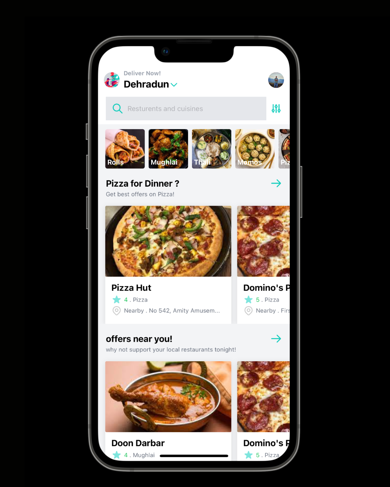
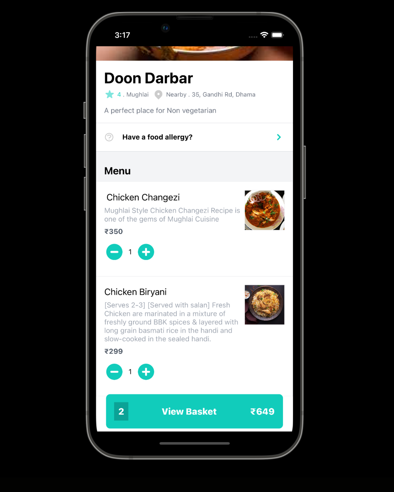
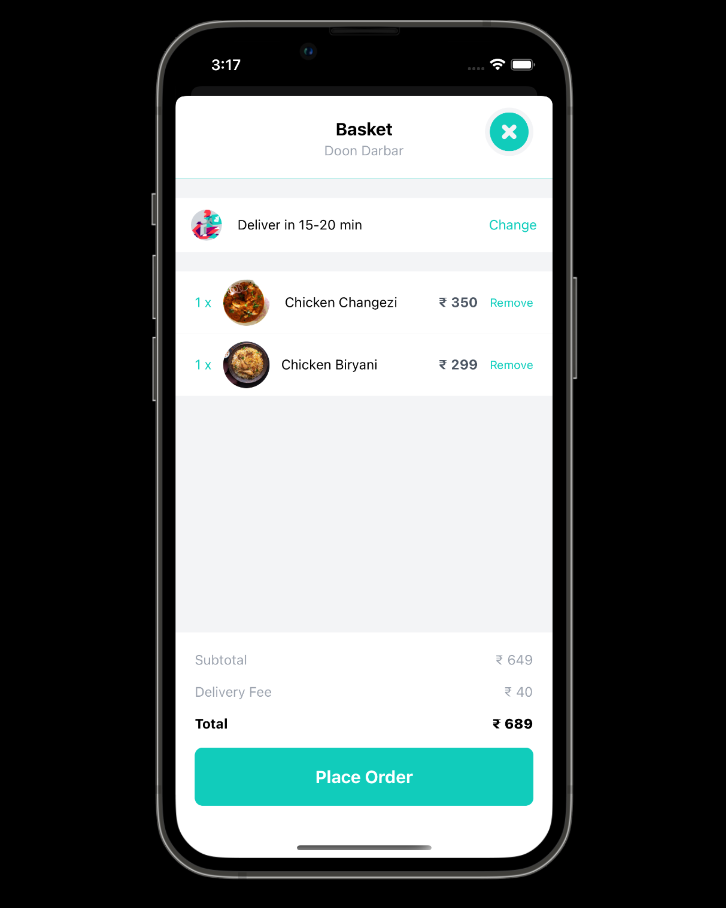
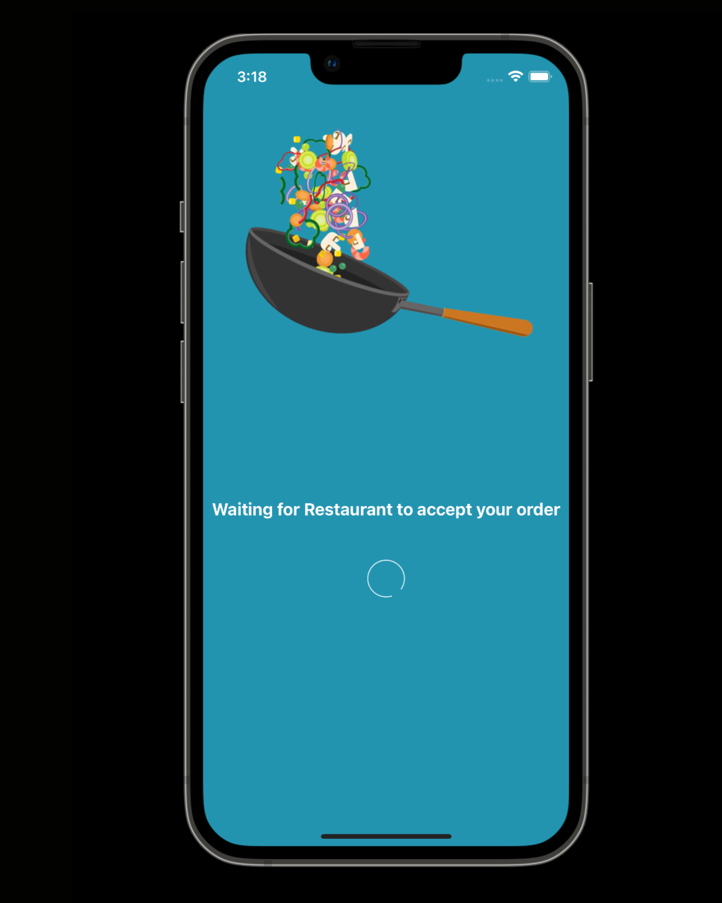
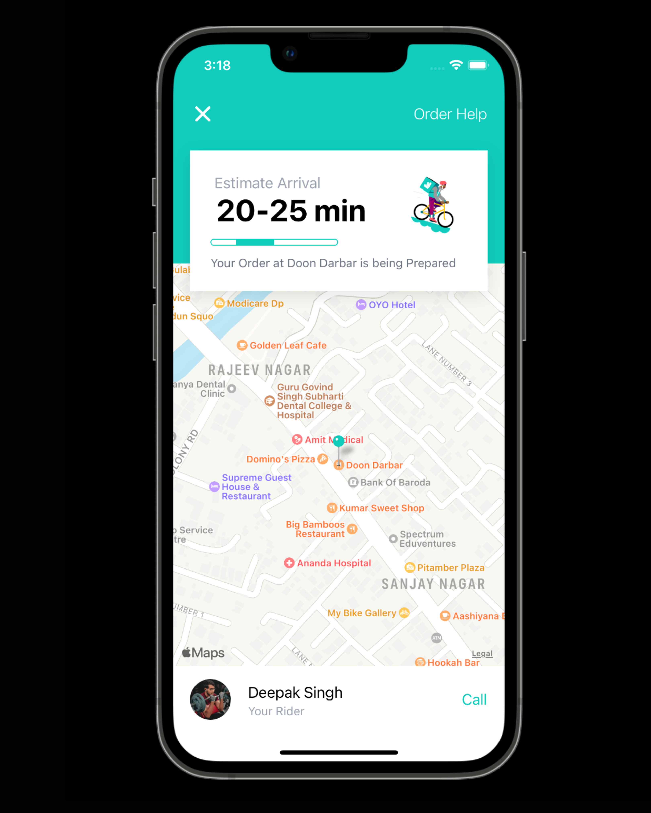

<!-- PROJECT LOGO -->
<p align="center">
  <a href="../assets/HungrezyLogo.png">
    
  </a>
  <p align="center">
    Giving your Hunger a new Option
    <br />
    <br />
    ·
    <a href="https://github.com/rishabhthakur11/Hungrezy/issues">Report Bug</a>
    ·
    <a href="https://github.com/rishabhthakur11/Hungrezy/issues">Request Feature</a>
    ·
    <br />
  </p>
</p>

<!-- TABLE OF CONTENTS -->

## Table of Contents

- [About the Project](#about-the-project)
  - [Built With](#built-with)
- [Getting Started](#getting-started)
  - [Prerequisites](#prerequisites)
  - [Referenced Repositories](#referenced-repositories)
  - [Installation](#installation)
- [Usage](#usage)
- [Roadmap](#roadmap)
- [Contributing](#contributing)
- [Contact](#contact)

<!-- ABOUT THE PROJECT -->

## About The Project

<!-- [![Product Name Screen Shot][product-screenshot]](https://example.com) -->

<p align ="center">


Get food delivery to your doorstep from thousands of amazing local restaurants. Find the meal you crave and order food from restaurants easily with the Hungrezy app. Track your order in real-time.

FIND YOUR FAVORITE FOOD & RESTAURANTS
Order food from nearby restaurants and search by cuisine, restaurant name, dish, meal. The Hungrezy app offers a variety of food delivery options for you to order and enjoy, including: pizza, burritos, burgers, sushi, and tasty Chinese takeout.

### Built With

<p float ="right">


</p>
<!-- GETTING STARTED -->

## Getting Started

To get a local copy up and for running the project locally, follow these simple steps.

### Prerequisites

Install sanity,npm & Expo

[Install npm](https://www.npmjs.com/get-npm)

[Install Expo](https://docs.expo.io/)


### Installation

1. Clone the repo

```sh
git clone https://github.com/rishabhthakur11/Hungrezy
```

3. Install Expo Cli if you haven't already

```sh
npm install -g expo-cli
```

3. Install packages

```sh
npm install
```

4. Build expo project and Run the bundler

```sh
expo start
```

<!-- USAGE EXAMPLES -->

## Usage

- Firstly, you will get the home page from where you can choose different Restaurants

<p align ="center">



- Select the items you wanted to order. You can also adjust the quantity.

<p align ="center">



- After that, you can review your items in the basket. Once done click to place order

<p align ="center">



- Once done, you have to wait for few sec. so that Restaurant can accept your order.

<p align ="center">



- Finally you will get your delivery time and driver contact detail on the Delivery Page.

<p align ="center">



## Demo Video


https://user-images.githubusercontent.com/74073486/183715506-4d357072-4986-4d15-b5d7-cefc059320e5.mp4

<!-- ROADMAP -->

## Roadmap

See the [open issues](https://github.com/rishabhthakur11/Hungrezy/issues) for a list of proposed features (and known issues).

<!-- CONTRIBUTING -->

## Contributing

Contributions are what make the open source community such an amazing place to be learn, inspire, and create. Any contributions you make are **greatly appreciated**.

1. Fork the Project
2. Create your Feature Branch (`git checkout -b feature/AmazingFeature`)
3. Commit your Changes (`git commit -m 'Add some AmazingFeature'`)
4. Push to the Branch (`git push origin feature/AmazingFeature`)
5. Open a Pull Request

<!-- CONTACT -->

## Contact

<!-- <Names> -->

Rishabh Thakur - [GitHub](https://github.com/rishabhthakur11) - rishabhthakur046@gmail.com


<p align = "center" >Made with ❤️ by Rishabh Thakur </p>
